> 이 글은 우테코 괜찮을지도팀의 `도이`가 작성했습니다.

보다 편리하고 안정적인 개발 및 배포를 위해, 괜찮을지도 서비스에 CI/CD를 적용하였습니다.  
이를 위한 도구로 GitHub Actions(self hosted runner)를 선택한 이유와, 파이프라인, 적용 방법에 대해 설명드리겠습니다.

## GitHub Actions를 사용한 이유

먼저 저희의 상황을 설명드리자면, 
아래와 같은 제약 사항 안에서 개발 서버, 운영 서버의 분리가 필요했습니다.

### 제약 사항
- EC2 최대 3개
- 최대 t4g.small
- 최대 20GiB
- 매모리 2GiB

운영 서버에서 사용하는 DB는 서버 분리가 필요하다고 판단해, 세 대의 인스턴스를 각각 아래 그림과 같이 개발, 운영, 운영 DB 서버로 분담했습니다.  
그리고 이 제약 사항 안에서 알뜰하게 서버를 사용하고 트러블 슈팅하는 것을 저희의 기술적 도전으로 삼고자 합니다.

### 인프라 구조
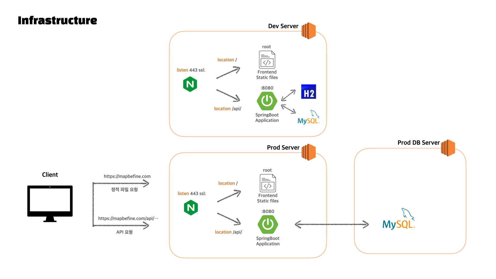
 
팀원들 모두가 CI/CD에 능숙하지 않은 상황에서 상대적으로 대중적이고 관련 자료를 쉽게 접할 수 있는 기술을 생각했을 때,  
Jenkins와 GitHub Actions가 고려 대상이었습니다.

아래와 같은 이유로, 둘 중 GitHub Actions를 사용해 최대한 간단하게 CI/CD를 구축하는 것이 적합하다고 판단했습니다.  

1. 메모리 부담 최소화
   - Jenkins를 사용하면, EC2에서 빌드 및 테스트를 수행해야 합니다.
   - 반면, GitHub Actions는 GitHub Artifact에 업로드한 빌드 결과물을 EC2에서 다운로드하면 됩니다.
   - 실제로 한 팀원이 EC2 t2g.micro에 젠킨스 CI/CD를 적용했다가, 메모리가 부족해 서버가 죽는 과거의 경험을 공유해주었습니다.
   - 때문에 적어도 CI 만큼은 GitHub Actions로 분리해 테스트 실행을 외부 서비스에 위임하기로 했습니다.
   - 하지만 그렇다면, 간결한 파이프라인을 위해 CI/CD를 모두 GitHub Actions로 통합하는 것이 좋다고 판단했습니다.
   > EC2에서 `./gradlew build`를 수행해 직접 빌드 및 테스트를 할 경우 아래와 같이 총 26.2%의 사용량이 확인되지만,  
   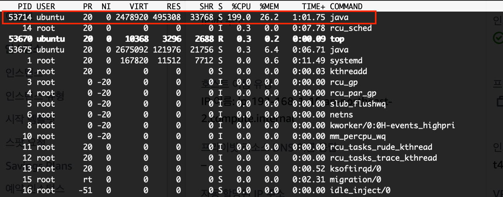
   > 그 대신 Actions Runner가 가동하는 상황을 확인해본 결과, 전체 메모리의 최대 11.9%만을 사용함을 알 수 있었습니다.   
   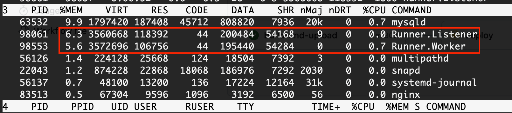
   
    
2. 쉽고 빠른 적용 
   - GitHub 레포지토리에서 바로 설정이 가능해 기존 개발 환경과 통합해 사용 가능합니다.
   - YAML 파일 작성만으로도 쉽고 빠른 적용이 가능합니다.
   - GitHub가 Runner를 관리해주기 때문에, 서버 관리 부담이 덜합니다.
  
  
## CI/CD 파이프라인

CI/CD 파이프라인은 다음과 같습니다.  
1. Pull Request의 생성 또는 업데이트, Pull Request에 대한 Merge가 발생합니다.
2. 이벤트에 트리거된 `GitHub Actions workflow`가 실행됩니다.
3. `workflow`에 작성한 내용에 의해, `GitHub hosting Runner`가 빌드 및 테스트를 수행합니다.
   - 이 때, 테스트 결과를 PR 코멘트로 등록해줍니다.
   - `Pull Request의 생성 또는 업데이트에 대한 workflow`의 경우 이 단계까지만 수행합니다.
4. `Pull request Merge에 대한 workflow`의 경우, 빌드한 결과물을 GitHub의 자체 저장소인 `Artifact Storage`에 업로드합니다.
5. 우리의 `EC2`에 설치된 `Self Hosted Runner`가 4번의 결과물을 다운로드 받습니다.
6. `Self Hosted Runner`가 배포 스크립트를 실행하게 하여, 필요한 어플리케이션을 실행하고 정적 파일을 적절한 위치에 배치합니다.

2번부터 6번까지, 모두 하나의 workflow 내에서 벌어지는 일입니다.

## 적용 방법

### GitHub Actions workflow
`workflow`란 하나 이상의 작업을 실행하는, 자동화된 프로세스입니다.  
레포지토리의 `.github/workflows` 디렉토리에 YAML 파일을 저장해 `workflow` 를 정의할 수 있습니다.
하나의 레포지토리는 여러 개의 `workflow`를 가질 수 있습니다.

괜찮을지도 서비스에서는
1. `pull request`에 대한 빌드 및 테스트만 수행하는 상황 vs `pull request merge` 시 배포까지 수행하는 상황
2. 대상이 `main` 브랜치 vs `dev` 브랜치
3. 대상이 프론트엔드 / 백엔드

세 가지 상황을 고려하여 여러 개의 `workflow`를 작성했습니다.  

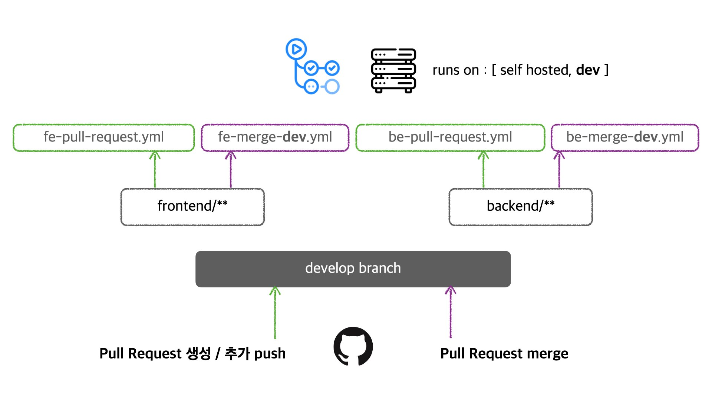
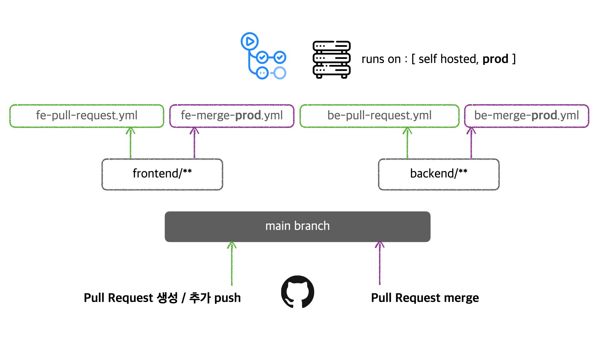

### workflow 만들기
`workflow`는 기본적으로 아래와 같은 요소들을 가져야 합니다.
1. `workflow`를 유발시킬 하나 이상의 이벤트 : `on`
2. `workflow`에서 수행할 하나 이상의 작업: `job`
3. `job` 블록 내에 단계 별 스크립트 또는 익스텐션 실행을 정의: `step`

여기서 주의할 점은, 여러개의 `job`은 기본적으로 병렬적으로 처리된다는 것입니다.  
순차적으로 실행하고 싶다면, `needs` 블록을 사용해야 합니다.  


아래는 현재 적용된 workflow입니다. 이해를 돕기 위해 주석을 추가하였습니다.  
### 백엔드 CI workflow
```yaml
name: Backend CI For Test Validation

# 트리거 설정
on:
  workflow_dispatch:
  
  pull_request:
    branches: [ main, develop ]
    paths: backend/** # 해당 디렉토리 내 파일의 변경이 있을 때만 트리거됨

# 테스트 결과 등록을 위한 권한 설정
permissions: 
  pull-requests: write
  checks: write
  contents: write
  
# 수행할 작업들
jobs:
  build-and-comment:
    # 해당 job을 실행할 환경 설정
    runs-on: ubuntu-22.04

    steps:
    - uses: actions/checkout@v3
    - name: Set up JDK 17
      uses: actions/setup-java@v3
      with:
        java-version: '17'
        distribution: 'temurin'
        
    - name: gradlew 실행 권한 부여
      run: chmod +x gradlew
      working-directory: backend

    - name: Gradle build 시작
      run: ./gradlew clean build
      working-directory: backend

    - name: 테스트 결과를 PR에 코멘트로 등록합니다
      uses: EnricoMi/publish-unit-test-result-action@v1
      if: always()
      with:
        files: 'backend/build/test-results/test/TEST-*.xml'

    - name: 테스트 실패 시, 실패한 코드 라인에 Check 코멘트를 등록합니다
      uses: mikepenz/action-junit-report@v3
      if: always()
      with:
        report_paths: '**/build/test-results/test/TEST-*.xml'
        token: ${{ github.token }}
```

### 백엔드 CD workflow
```yaml
name: Backend develop CI/CD

on:
  workflow_dispatch:
  
  pull_request:
     # 배포 설정은 main, develop 브랜치 별로 다르게 트리거
    branches: [ develop ]
     # 브랜치가 닫힐 때만 트리거
    types: [closed]
    paths: backend/**

permissions:
  contents: read
  
jobs:
  build-and-upload:    
    # Pull Request를 그냥 닫은 게 아니라, merge해서 닫았을 때만 실행
    if: github.event.pull_request.merged
    
    runs-on: ubuntu-22.04

    steps:
    - uses: actions/checkout@v3
    - name: Set up JDK 17
      uses: actions/setup-java@v3
      with:
        java-version: '17'
        distribution: 'temurin'
        
    - name: gradlew 실행 권한 부여
      run: chmod +x gradlew
      working-directory: backend

    - name: Gradle build 시작
      run: ./gradlew clean build
      working-directory: backend
        
    - name: jar 파일 artifact에 업로드
      uses: actions/upload-artifact@v3
      with:
        name: BackendApplication
        path: backend/build/libs/mapbefine.jar

  deploy:
     # Pull Request를 그냥 닫은 게 아니라, merge해서 닫았을 때만 실행
     if: github.event.pull_request.merged

     # deploy는 build-and-upload 작업과 달리 self-hosted runner를 사용
     # main, develop 브랜치마다 각각 운영 서버, 개발 서버의 runner만을 실행하도록 해야 함
     runs-on: [ self-hosted, dev ]를
     # build-and-upload 작업이 성공적으로 완료될 경우 실행
     needs: build-and-upload
  
     steps:
      - name: 구버전 jar 파일 삭제
        run: rm -rf /home/ubuntu/backend/build/*.jar 

      - name: jar파일 artifact에서 다운로드
        uses: actions/download-artifact@v3 
        with:
          name: BackendApplication
          path: /home/ubuntu/backend/build/

      - name: 배포하기
        run: /home/ubuntu/backend/deploy.sh

      - name: 슬랙 메시지 보내기

        uses: 8398a7/action-slack@v3
        with:
          mention: 'here'
          if_mention: always
          status: ${{ job.status }}
          fields: workflow,job,commit,message,ref,author,took
        env:
          SLACK_WEBHOOK_URL: ${{ secrets.SLACK_WEBHOOK_URL }}
        if: always()
```

### 프론트엔드 CI workflow
```yaml
name: Frontend CI For Test Validation
# 어떤 이벤트가 발생하면 실행할지 결정
on:
  #pull request open과 reopen 시 실행한다.
  pull_request:
    branches: [main, develop]
    paths: frontend/**
defaults:
  run:
    working-directory: ./frontend
jobs:
  jest:
    runs-on: ubuntu-22.04

    steps:
      - name: Checkout repository
        uses: actions/checkout@v2

      - name: Setup Node.js
        uses: actions/setup-node@v2
        with:
          node-version: "18"

      - name: Install node modules
        run: npm install

      - name: Run Jest test
        run: npm run test
```

### 프론트엔드 CD workflow
```yaml
name: Frontend develop CD

on:
  workflow_dispatch:

  pull_request:
    branches: [ develop ]
    types: [ closed ]
    paths: frontend/**

permissions:
  contents: read

jobs:
  build-and-upload:
    if: github.event.pull_request.merged

    runs-on: ubuntu-22.04

    steps:
      - uses: actions/checkout@v3
      - name: Set up Node.js 18
        uses: actions/setup-node@v3
        with:
          node-version: 18
          cache: "npm"

      - name: Install npm
        run: npm install --force

      - name: grant excute access
        run: chmod +x npm

      - name: Build project
        run: npm run build

      - name: upload to artifact
        uses: actions/upload-artifact@v3
        with:
          name: FrontendApplication
          path: frontend/dist

  deploy:
      runs-on: [ self-hosted, dev ]
      needs: build-and-upload

      if: github.event.pull_request.merged

      steps:
        - name: delete old js file
          run: rm -rf /home/ubuntu/frontend/dist

        - name: download js file from artifact
          uses: actions/download-artifact@v3
          with:
            name: FrontendApplication
            path: /home/ubuntu/frontend

        - name: deploy
          run: /home/ubuntu/frontend/deploy.sh

        - name: send slack message

          uses: 8398a7/action-slack@v3
          with:
            mention: 'here'
            if_mention: always
            status: ${{ job.status }}
            fields: workflow,job,commit,message,ref,author,took
          env:
            SLACK_WEBHOOK_URL: ${{ secrets.SLACK_WEBHOOK_URL }}
          if: always()

```

## Self-hosted Runner 
앞서 말씀드린 파이프라인 대로 배포를 하기 위해서는, 배포를 할 서버에 `GitHub Actions`의 `Self-hosted Runner`를 설치해야 합니다.  

앞서 설명드린 `workflow`는 GitHub에서 호스팅하는 Runner가 수행할 수도 있지만,  
원하는 서버에 자체적으로 Runner를 호스팅하여 사용할 수도 있습니다.

workflow의 `runs-on` 블록에서 어떤 Runner를 통해 작업을 수행할지 정의합니다.


### EC2에 Self-hosted Runner 띄우기

#### 1. 다운로드  
레포지토리의 `Settings` - `Actions` - `Runners`에 들어가면 `New self-hosted runner` 버튼이 있습니다.  
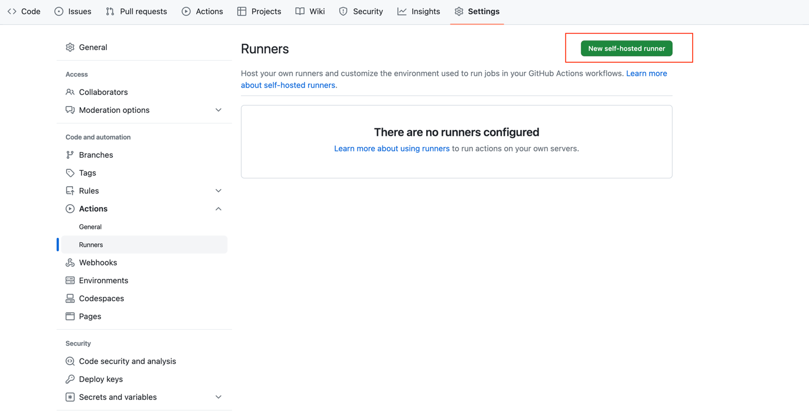
버튼을 누르면 아래와 같은 설정 페이지로 접속하는데, Runner를 띄울 서버 환경에 맞는 설정을 선택해줍니다.  
   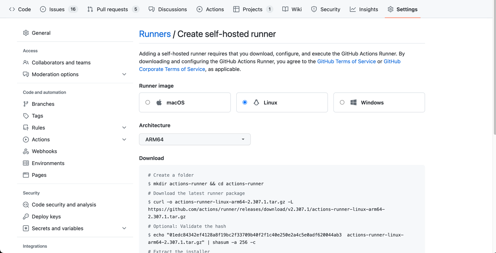
해당 환경의 터미널에서 runner package를 다운로드합니다. 선택한 설정에 맞게 제공된 커맨드를 복사해 실행하면 됩니다.  
   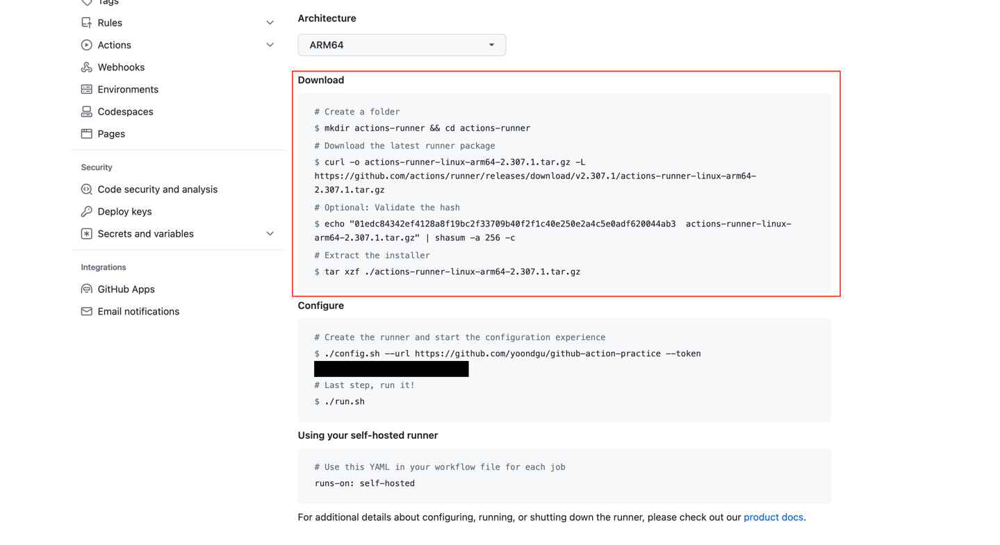   

아래는 Linux, ARM64 환경의 runner를 다운로드받기 위한 스크립트입니다.  
  ```shell
  # Create a folder
  $ mkdir actions-runner && cd actions-runner
  # Download the latest runner package
  $ curl -o actions-runner-linux-arm64-2.307.1.tar.gz -L https://github.com/actions/runner/releases/download/v2.307.1/actions-runner-linux-arm64-2.307.1.tar.gz
  # Optional: Validate the hash
  $ echo "01edc84342ef4128a8f19bc2f33709b40f2f1c40e250e2a4c5e0adf620044ab3  actions-runner-linux-arm64-2.307.1.tar.gz" | shasum -a 256 -c
  # Extract the installer
  $ tar xzf ./actions-runner-linux-arm64-2.307.1.tar.gz
  ```
   
#### 2. Runner 생성 및 설정
마찬가지로 제공된 스크립트에 따라, runner를 생성하고 설정합니다.  
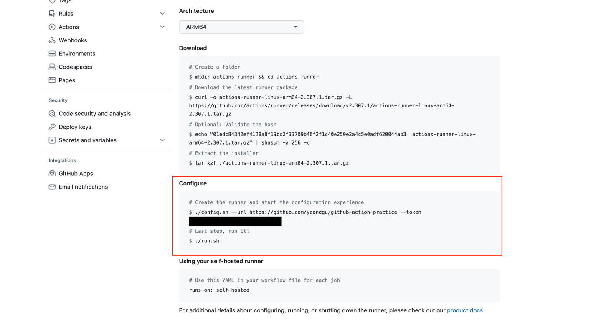
먼저 아래 커맨드를 실행하면, 아래와 같이 Runner 환경 설정을 위해 몇 가지를 입력해야 합니다.  
```shell
$ ./config.sh --url ${repository URL} --token ${runner 생성 페이지에서 제공된 토큰}
```
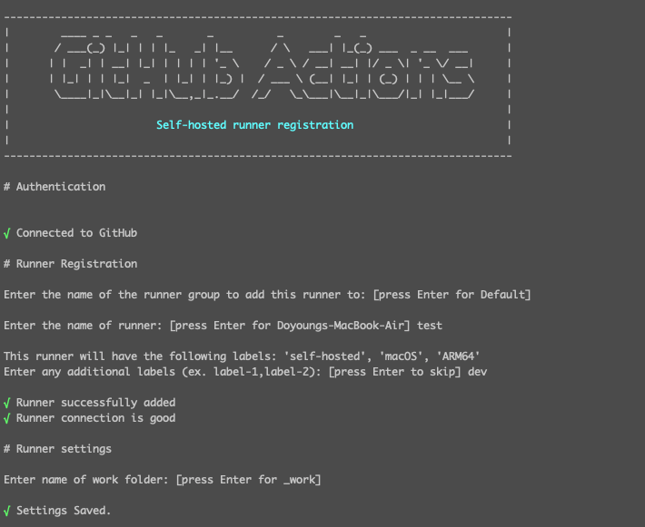

위 이미지처럼 name, 추가 label을 지정하고 설치한 runner를 확인하면, 다음과 같이 `dev` 라벨이 추가된 것을 확인할 수 있습니다.
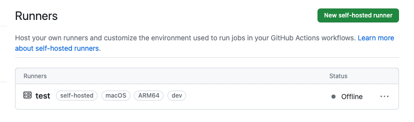
> ⚠️ 개인 로컬에서 테스트로 만든 예시 이미지로, 실제 서비스의 운영 환경과는 상이합니다.

더 빠른 설정을 원한다면, 아래와 같이 `./config.sh` 실행 시 원하는 값들을 바로 전달해줘도 됩니다.
```shell
$ ./config.sh --url ${repository URL} --token ${runner 생성 페이지에서 제공된 토큰} --name test --labels dev
```

   > **label을 왜 추가했을까요?**    
   각 Runner를 구분할 수 있는 label을 지정해서 `runs-on` 블록에서 어떤 Runner에게 일을 시킬지 명시하기 위함입니다.  
   괜찮을지도 팀은 한 리포지토리에서 운영 서버, 개발 서버에 각각 띄울 두 개의 Runner를 사용하기 때문에
   이를 구분하기 위한 `dev`, `prod` label을 지정하였습니다.  
   아래는 `dev`, `self-hosted` 라벨을 가진 runner를 지정하는 예시입니다.
   ```YAML
   runs-on: [ self-hosted, dev ]
   ```
   > **이미 생성한 Runner에 label을 추가하려면?**  
   GitHub 공식문서에 따르면, 2023년 2월부터 GUI로 label을 추가하는 기능을 제공하지 않는다고 합니다.    
   config.sh 파일을 수정해 설정할 수도 없습니다.    
   대신 GitHub에서 제공하는 "Self-hosted runners" REST API를 사용해 추가해주어야 합니다.

#### 3. Runner 실행
   Runner 설정이 완료되었다면, 아래 명령어로 Runner를 실행합니다.  
   레포지토리의 `Settings` - `Actions` - `Runners` 페이지에서 Status가 `idle`로 바뀌었다면 정상적으로 실행된 것입니다.
   ```shell
   $ ./run.sh
   ```

참고로 서버 내 저장한 환경변수를 업데이트 했을 때에는, Runner도 재시작하기를 잊지 마세요!  
왜일까요? 자세한 내용은  
[EC2 환경 변수 적용 및 Actions Runner에 환경 변수 적용이 안되는 이슈](https://map-befine-official.github.io/trouble-shooting-actions-runner)에서 확인하실 수 있습니다.


## 참고 자료
https://docs.github.com/ko/actions/using-workflows/about-workflows  
https://docs.github.com/en/actions/hosting-your-own-runners/managing-self-hosted-runners/about-self-hosted-runners  
https://docs.github.com/en/actions/hosting-your-own-runners/managing-self-hosted-runners/using-labels-with-self-hosted-runners  
