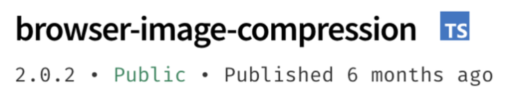
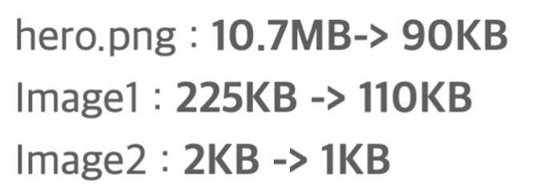
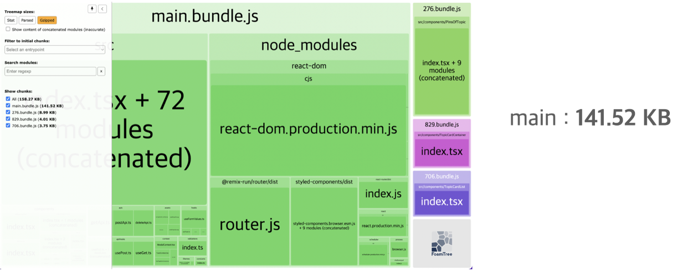
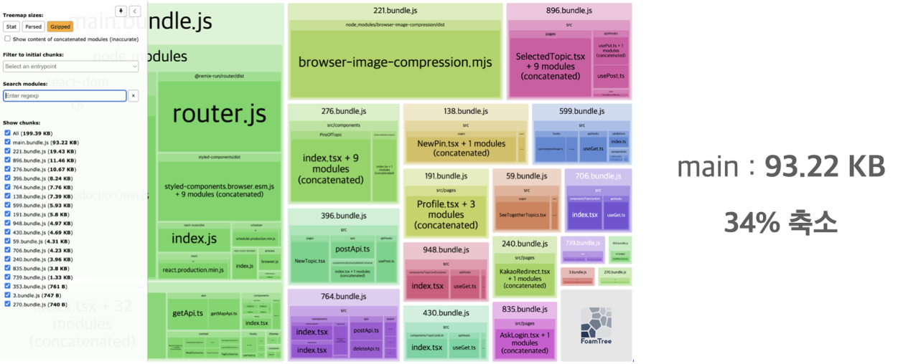

> 이 글은 우테코 괜찮을지도팀의 `패트릭`이 작성했습니다.

홈페이지에서 용량을 많이 차지하고 페이지 로딩 속도에 영향을 미치는 이미지와 번들 사이즈 최적화를 진행하였습니다.

## 이미지 최적화

홈페이지에서 가장 많은 용량을 차지하고 페이지 로딩 속도에 가장 큰 영향을 미치는 것은 이미지라는 의견이 나왔습니다. 백엔드 쪽에서는 이미지 업로드 용량 한계치를 두고 프론트 단에서 용량을 줄이기로 하였습니다.

### browser-image-compression 라이브러리 사용


그리고 하나의 이미지와 여러 개의 이미지를 압축하는 곳이 따로 있어 구분해서 적용하기 위해 custom hook으로 분리하였습니다.
```typescript
import imageCompression from 'browser-image-compression';

const useCompressImage = () => {
  const compressImage = async (file: File) => {
    const resizingBlob = await imageCompression(file, {
      maxSizeMB: 1, // 최대 이미지 용량
      maxWidthOrHeight: 750, // 최대 이미지 크기
      useWebWorker: true, // 비동기 처리 유무
    });
    const resizingFile = new File([resizingBlob], file.name, {
      type: file.type,
    });
    return resizingFile;
  };

  const compressImageList = async (files: FileList) => {
    const compressedImageList: File[] = [];

    for (const file of files) {
      const compressedImage = await compressImage(file);
      compressedImageList.push(compressedImage);
    }

    return compressedImageList;
  };

  return { compressImage, compressImageList };
};

export default useCompressImage;
```

이를 통해 성능이 개선된 지표입니다.



## 번들 사이즈
이미지 다음으로 번들 사이즈가 페이지 로딩 속도에 영향을 끼친다는 것을 알았습니다. 동적 import(lazy, suspense 이용)와 tree shaking을 통해 개선할 수 있었습니다.

```typescript
const SelectedTopic = lazy(() => import('./pages/SelectedTopic'));
const NewPin = lazy(() => import('./pages/NewPin'));
const NewTopic = lazy(() => import('./pages/NewTopic'));
const SeeAllPopularTopics = lazy(() => import('./pages/SeeAllPopularTopics'));
const SeeAllNearTopics = lazy(() => import('./pages/SeeAllNearTopics'));
const SeeAllLatestTopics = lazy(() => import('./pages/SeeAllLatestTopics'));
const KakaoRedirect = lazy(() => import('./pages/KakaoRedirect'));
const Profile = lazy(() => import('./pages/Profile'));
const AskLogin = lazy(() => import('./pages/AskLogin'));
const Bookmark = lazy(() => import('./pages/Bookmark'));
```

```typescript

function SuspenseComp({ children }: SuspenseCompProps) {
  return <Suspense fallback={null}>{children}</Suspense>;
}

{
  path: 'topics/:topicId',
  element: (
    <SuspenseComp>
      <SelectedTopic />
    </SuspenseComp>
  ),
  withAuth: false,
},
{
  path: 'new-topic',
  element: (
    <SuspenseComp>
      <NewTopic />
    </SuspenseComp>
  ),
  withAuth: true,
},
{
  path: 'new-pin',
  element: (
    <SuspenseComp>
      <NewPin />
    </SuspenseComp>
  ),
  withAuth: true,
},
{
  path: 'see-all/popularity',
  element: (
    <SuspenseComp>
      <SeeAllPopularTopics />
    </SuspenseComp>
  ),
  withAuth: false,
},
{
  path: 'see-all/near',
  element: (
    <SuspenseComp>
      <SeeAllNearTopics />
    </SuspenseComp>
  ),
  withAuth: false,
},
{
  path: 'see-all/latest',
  element: (
    <SuspenseComp>
      <SeeAllLatestTopics />
    </SuspenseComp>
  ),
  withAuth: false,
},
{
  path: 'favorite',
  element: (
    <SuspenseComp>
      <Bookmark />
    </SuspenseComp>
  ),
  withAuth: true,
},
{
  path: 'my-page',
  element: (
    <SuspenseComp>
      <Profile />
    </SuspenseComp>
  ),
  withAuth: true,
},
{
  path: '/askLogin',
  element: (
    <SuspenseComp>
      <AskLogin />
    </SuspenseComp>
  ),
  withAuth: false,
},
```


- 개선 전


- 개선 후
