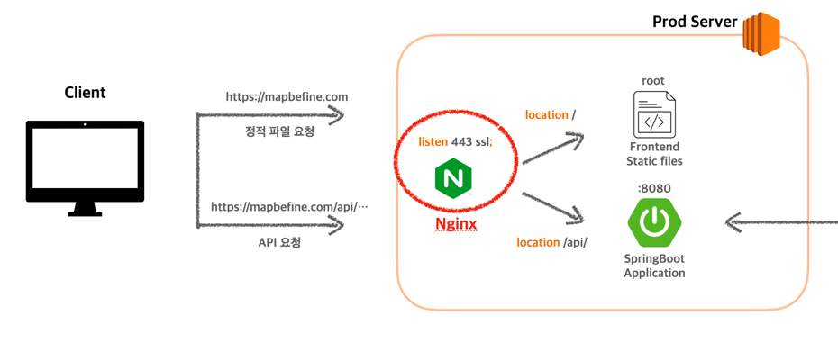

> 이 글은 우아한테크코스 괜찮을지도팀의 `도이`가 작성했습니다.

지난 글 [GitHub Actions로 CI/CD 구축하기](https://map-befine-official.github.io/github-actions-ci-cd)에서  
현재 저희 프로젝트의 인프라 구조를 간략하게 이미지로 설명드렸습니다.

다시 이미지를 보여드리자면, 서버의 앞단에서 Nginx를 사용하고 있는데요.


> ⚠️ 편의상 개발 서버, DB 서버 부분은 생략하고 확대한 이미지입니다.  
> 개발 서버의 Nginx도 같은 역할을 수행합니다.
 
이번 글에서는 Nginx의 모든 것에 대해 설명하기보다는 Nginx를 왜 썼는지, 어떻게 썼는지에 초점을 맞춰보도록 하겠습니다.  

## Nginx란?
그래도 이게 뭔지 알아야겠죠? 간단하게 설명하면, 경량화된 웹 서버 프로그램입니다.  
정적 파일을 제공하는 HTTP 서버로도, 리버스 프록시 서버로도 사용할 수 있습니다.  

이제 저희의 Nginx 설정 파일을 보면서 어떻게 활용했는지 설명드리겠습니다.

> 설정 파일은 과거 방식으로는 /etc/nginx/sites-available 또는 /sites-enabled에서 관리하고,  
> 최신 방법으로는 /etc/nginx/conf.d 디렉토리에서 관리합니다.
```properties
server {
        # (1) HTTPS 적용 전, 서버 이름 지정
        server_name ${도메인};

        # (1) HTTPS 적용 : SSL을 사용하여 443포트에서 수신
        listen 443 ssl; # managed by Certbot
        ssl_certificate /etc/letsencrypt/live/${도메인}/fullchain.pem; # managed by Certbot
        ssl_certificate_key /etc/letsencrypt/live/${도메인}/privkey.pem; # managed by Certbot
        include /etc/letsencrypt/options-ssl-nginx.conf; # managed by Certbot
        ssl_dhparam /etc/letsencrypt/ssl-dhparams.pem; # managed by Certbot

        # (3) 웹 서버의 루트 디렉토리 지정
        root /var/www/html;

        # (3) 웹 서버가 디렉토리를 열 때 사용할 기본 파일 지정 (나열된 순서대로 탐색)
        index index.html index.htm index.nginx-debian.html;

        # (2, 3) 루트 URL에 대한 동작 정의 : 프론트엔드 정적 파일 서브
        location / {
            root /usr/share/nginx/html/dist;
            include /etc/nginx/mime.types;
            try_files $uri $uri/ /index.html;
        }

        # (2) /api/ URL에 대한 동작 정의 : 백엔드 API 연결
        location /api/ {
            rewrite ^/api/(.*) /$1?$args break;
            proxy_pass http://${서버 IP 주소}:8080;
            proxy_set_header Host $host;
            proxy_set_header X-Real-IP $remote_addr;
            proxy_set_header X-Forwarded-For $proxy_add_x_forwarded_for;
        }
}
```

## (1) HTTPS 적용하기
SSL 인증서만 있으면, 웹서버를 통해 쉽게 HTTPS 프로토콜을 적용할 수 있습니다.  
무료 이용이 가능하고, `Nginx`와 통합하여 사용하기 좋은 `Certbot`을 사용해 이를 적용했습니다.  
전체적인 흐름은 아래와 같습니다.  

1. 도메인을 구매하고, 레코드 A에 public IP 주소를 등록한다.
2. `Cerbot`을 설치한다.
3. 설정 파일의 server_name을 구매한 도메인으로 변경한다.
4. `Certbot`을 이용해 구매한 도메인을 이용해 SSL 인증서를 발급받는다.
5. 인증서를 발급받으면, `Certbot`이 자동으로 설정 파일에서 server_name이 일치하는 블록을 찾아 SSL 관련 내용들을 추가해준다.

`# managed by Certbot`이라는 주석이 붙어있는 내용들이 `Certbot`이 추가해준 내용입니다.

> `Certbot`은 SSL 인증 발급 도구로, 무료 SSL 인증서 발급 기관인 `Let's Encrypt`와 통합되어 있습니다.  
> 이를 통해 쉽게 SSL 인증서를 발급받을 수 있습니다.  
> 또, `Nginx` 설정 파일을 자동 업데이트하는 방식으로 SSL 인증서를 적용할 수 있어 편리합니다.
> 단, 유효 기간이 90일이기 때문에 자동 갱신 설정이 별도로 필요합니다.  

하단에 첨부한 참고 자료와 같이, 잘 정리된 자료가 기존에 많기 때문에 자세한 내용은 생략하겠습니다.
 
**(redirect 설정 추가하기)**

## (2) 프론트엔드, 백엔드 요청 구분하기
저희 프로젝트의 인프라 구조에서는 프론트엔드와 백엔드가 같은 서버를 공유하므로  
클라이언트가 이용하는 화면에 대한 요청과, 백엔드 API에 대한 요청을 구분할 필요가 있었습니다.  

`location` 블록을 사용해 특정 URL에 대한 동작을 설정하는 방식으로 이를 구분할 수 있었습니다.  

해당하는 부분을 가져와 설명드리겠습니다.
```properties
# 루트 URL에 대해 프론트엔드 정적 파일 서브
location / {
    root /usr/share/nginx/html/dist;
    include /etc/nginx/mime.types;
    try_files $uri $uri/ /index.html;
}

# /api/ URL에 대해 백엔드 API 연결
location /api/ {
    rewrite ^/api/(.*) /$1?$args break; # URL에서 /api 제거
    proxy_pass http://${서버 IP 주소}:8080;
    proxy_set_header Host $host;
    proxy_set_header X-Real-IP $remote_addr;
    proxy_set_header X-Forwarded-For $proxy_add_x_forwarded_for;
}
```

`https://mapbefine.com/api/` 로 시작하는 URL에 대해서는 백엔드 API와 연결합니다.  

이 설정을 맞추어, 백엔드 코드에서 `/api`가 추가된 요청 URL을 매핑할 수도 있습니다.  
하지만 이는 자원을 명시하기 위한 내용보다는 요청을 구분하기 위함이므로,  
리버시 프록시를 거치고 나면 실제로는 `/api`를 제외한 요청 URL로 연결되도록 하였습니다.  
`# URL에서 /api 제거` 주석이 있는 부분이 해당하는 내용입니다.  

> `proxy_set_header`는 Nginx가 프록시 요청을 전달하기 전에, HTTP 요청 헤더를 설정하는 지시문입니다.  
> 원래 요청의 호스트 이름을 백엔드 서버에 전달합니다.  
> 필수 설정은 아니지만 IP 기반의 접근 제어, 로깅, 다중 호스트 설정 등에 유용할 수 있다고 합니다.  

## (3) 정적 파일 서브하기
저희는 프론트엔드의 React를 서버에서 실행시키는 대신, 빌드 결과물을 정적 파일로 서브하는 방식을 택하였습니다.  
이유는 다음과 같습니다.  
1. 어플리케이션을 서버 내에 실행하여 동적으로 파일을 생성해야 하는 상황이 아닙니다.
2. 정적 파일로 서브하여 서버 메모리를 절약할 수 있습니다.
3. 지속적 배포가 구축되어 있기 때문에 빌드 결과물을 업데이트하는 과정에 번거로움도 없습니다.  
**(이유 맞는지 확인)**

어플리케이션을 실행시킨 상태라면, 해당하는 URL에 대해 3000번 포트로 포워딩해주면 됩니다.

반면 정적 파일로 서브한다면 어떻게 해야 할까요?  
해당하는 부분을 가져와 설명드리겠습니다.

아래 내용은 설정 파일의 기본 값과 같습니다.
```properties
# (3) 웹 서버의 루트 디렉토리 지정
root /var/www/html;

# (3) 웹 서버가 디렉토리를 열 때 사용할 기본 파일 지정 (나열된 순서대로 탐색)
index index.html index.htm index.nginx-debian.html;
```

`https://mapbefine.com` 요청이 들어오면, Nginx는 루트 디렉토리의 `index.html`을 우선적으로 찾아 반환합니다.  
따라서 해당 웹 서버의 루트 디렉토리에 우리의 빌드 결과물인 `index.html`와 모듈 파일들을 위치시키면 됩니다.  
반대로, 정적 파일을 저장하고 있는 위치를 root 값으로 설정해주어도 좋습니다.

## 결론
괜찮을지도 서버의 Nginx는  
클라이언트와 WAS(Spring Boot) 사이에 Nginx를 두어 리버스 프록시 서버로 사용하며,  
동시에 HTTPS 적용을 해결하고 HTTP 서버와 같이 정적 파일 서브도 수행하고 있습니다.

다만 현재 규모에서 간단한 방법을 택한 것으로,  
서비스의 규모가 커짐에 따라 정적 파일을 별도 서버에 관리하는 것이 유리하거나 동적인 파일 생성이 필요한 경우 활용 방식은 얼마든지 달라질 수 있을 것입니다.


## 참고자료
[Nginx 공식 문서](https://nginx.org/en/docs/)  
[baledung - sites-available & sites-enabled, conf.d 설정 파일 방식 차이](https://www.baeldung.com/linux/sites-available-sites-enabled-conf-d)  
[Nginx와 Let's Encrypt로 HTTPS 웹 서비스 배포하기 (feat. Certbot)](https://hudi.blog/https-with-nginx-and-lets-encrypt/)  
