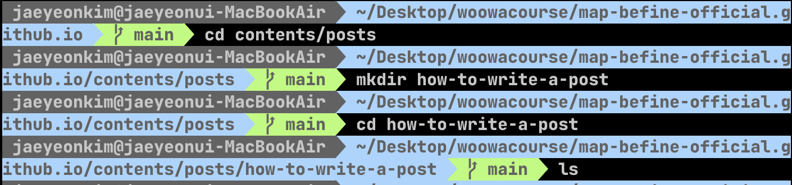
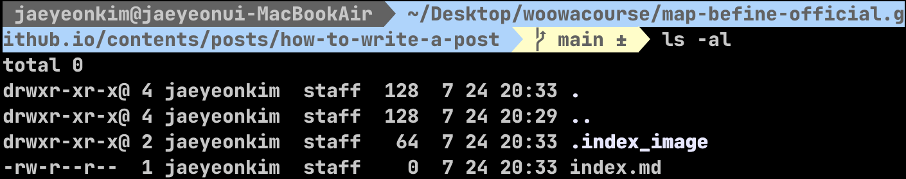
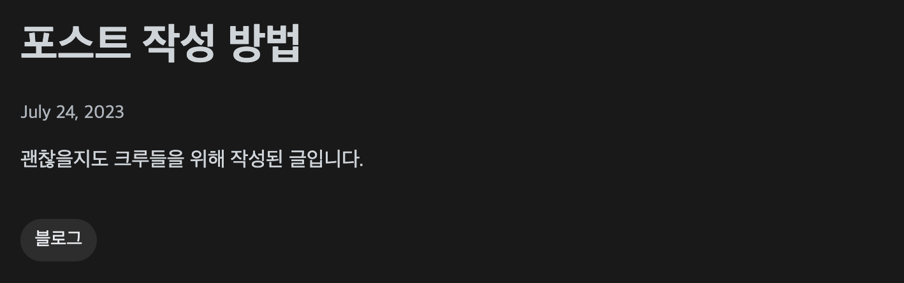

> 이 글은 우테코 괜찮을지도팀의 `매튜` 작성했습니다

첫 글은 포스트 작성법에 대해서 다루어보도록 하겠습니다.

### Repository Local 로 Clone 해오기 

본인이 원하는 Directory 로 이동해 

```shell
git clone https://github.com/map-befine-official/map-befine-official.github.io 
``` 

위와 같은 명령어를 이용하여 우리 팀의 Repository 를 Local 로 가져옵니다.

## 글 작성하기

Repository 를 Local 로 가져오셨다면, 이제 글을 작성해봅시다!

```shell
cd map-befine-official.github.io
```

위 명령어를 통해서 map-befine-official.github.io 에 Directory 에 들어가주시면 Contents Directory가 보이실 겁니다.

여기서 

```shell
cd contents/posts
```

위 명령어를 통해 contents/posts 디렉토리 내부까지 가고

본인이 작성하고자 하는 주제에 걸맞는 이름으로 Directory 를 생성한 후, 만드신 Directory까지 들어가주세요

저 같은 경우는 Directory 명을 how-to-write-a-post 로 지었기 때문에

```shell
cd how-to-write-a-post
```

위와 같은 명령으를 통해 이동해주었습니다.



여기서부터 이제 `index.md` 파일을 만들어 작성하실 글을 Markdown 형식으로 작성 해주시면되고, `.index_image` 라는 이름으로 Directory 만들어 해당 Directory 에 이미지 파일을 넣어주시면 됩니다.

잘 따라오셨다면 최종적으로 이런 구조가 나올겁니다!



## 글 올리기!

글을 모두 작성하셨다면 이제 올리기만 하면 될 겁니다.

아주 쉽습니다.

그냥 main 브랜치에 push 를 하시면되요!

`.github/workflows/deploy.yml` 로 인해서 push 만 하셔도 배포 될겁니다.

야물딱지죠?

우리 글도 한번 야무지게 써봅시다!

## 글의 제목 작성하기

글의 서두에 

```text
---
title: "제목"
description: "설명"
date: "작성 날짜"
update: "수정 날짜"
tags:
  - 태그들
  - ...
---
```

이런 식으로 작성해주셔야지 



위에서 보시는 바와 같이 하실 수 있습니다.

## 이미지 삽입

이미지를 삽입하시고 싶으시다면, 

저의 가이드를 모두 잘 따르셨다고 가정했을 때, .index_image 내부에 image 파일을 넣고

```text

```

이런 식으로 작성해주시면 이미지도 정상적으로 삽입하실  수 있습니다!

## 주의!

다른 사람들의 정성스런 글을 날리지 않기 위해, 항상 Push 이전에 Pull 해주는 거 잊지 않으셨죠? ㅋㅋㅋ

물론 Warning Message 가 뜨긴 할테지만, 잊지 말아주세용~~~

## 레퍼런스 

https://pium-official.github.io/blog-starter/


