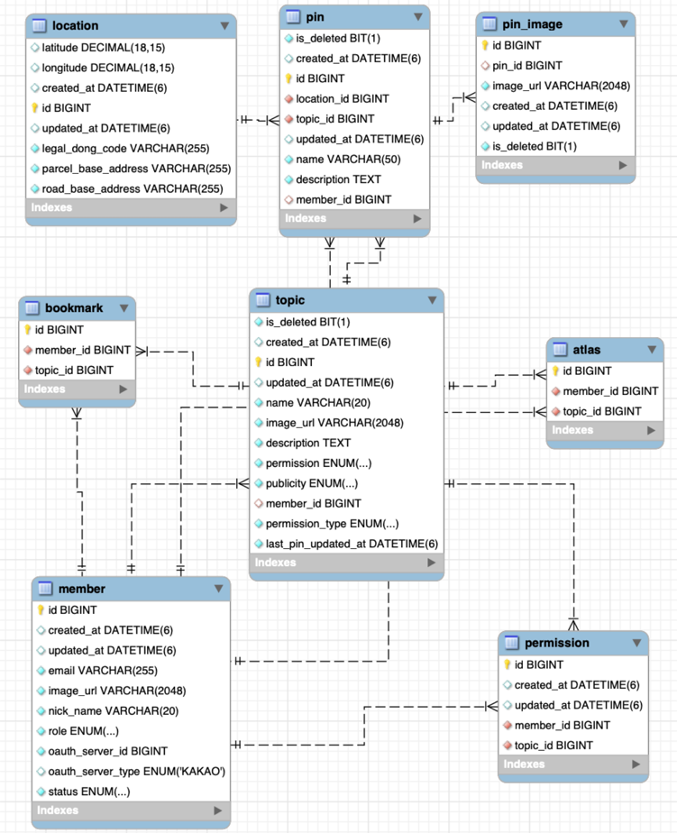

> 이 글은 우테코 괜찮을지도팀의 `도이`가 작성했습니다.

## N+1과 Fetch join

백엔드에서는 조회 API로 여러 연관 관계로 인해 발생하는 N+1 문제를 해결해야 했는데요.  
예를 들면 핀 다건 조회의 경우, 각 핀이 속한 지도(topic), 위치, 생성자, 핀 이미지들을 모두 별도로 조회하는 심각한 문제가 있었습니다.  
지도(topic) 조회 시에도 생성자, 권한 정보, 즐겨찾기 목록을 매번 불러왔고요.   



따라서 함께 가져올 연관 관계들에 대해 `Fetch join`을 적용하는 방식으로 문제에 접근했습니다.  

> `Fetch join`은 JPQL에서 성능 최적화를 위해 제공하는 기능입니다.  

### @EntityGraph
`Fetch join`을 위한 방법으로는, `@EntityGraph`를 선택했습니다.  
JPQL에 직접 하드코딩으로 쿼리를 작성하는 것보다, 가독성 및 유지보수성에 더 좋다고 판단했기 때문입니다.

`@EntityGraph`는, 객체를 로딩할 때 런타임 성능을 개선하기 위해 JPA 2.1에서 도입된 기능입니다.  
JPA 2.0 이전까지는 `FetchType`으로만 로딩 전략을 지정할 수 있었지만   
이를 통해 객체의 연관 관계 중 그래프로 연결할 것들을 템플릿으로 정의하고, 런타임에 선택할 수 있습니다.  
원하는 필드들만 쉽게 Fetch join 시킬 수 있는 것이죠.

```java
// PinRepository.class
// 해당 쿼리로 데이터를 읽을 때, Topic의 필드로 존재하는 "location", "topic", "creator", "pinImages"를 Fetch join으로 불러옵니다.
@EntityGraph(attributePaths = {"location", "topic", "creator", "pinImages"})
List<Pin> findAllByCreatorId();
```

## 문제 상황
`@EntityGraph`는 동적으로 생성되므로  
해당 어노테이션에 작성한 설정이 잘못 되었어도, 컴파일 타임이 아니라 해당 쿼리를 사용하는 런타임 시점에 예외가 발생합니다.  

여러 필드들을 `attributePaths`에 넣어본 뒤, 로컬 환경에서 API를 호출하며 쿼리 개수 및 지연 시간을 확인하던 중  
아래와 같은 오류가 발생했습니다.

```
org.hibernate.loader.MultipleBagFetchException: cannot simultaneously fetch multiple bags: 
[com.mapbefine.mapbefine.topic.domain.Topic.bookmarks, com.mapbefine.mapbefine.topic.domain.Topic.permissions]
```

호출된 쿼리는 아래와 같았습니다.
```java
// TopicRepository.class
@EntityGraph(attributePaths = {"creator", "permissions", "bookmarks"})
List<Topic> findAll();
```

## MultipleBagFetchException의 발생 이유
간단하게 이야기하면 **`OneToMany` 관계를 1개보다 더 많이 Fetch join** 하려고 했기 때문에 발생한 문제입니다.  
"permissons"와 "bookmarks"를 동시에 Fetch join할 수 없습니다.

### Fetch join과 카테시안 곱
Fetch join은 `*ToOne` 관계에는 개수 제한이 없지만, `*ToMany` 관계를 1개만 사용할 수 있습니다.  
fech join을 여러 개의 컬렉션에 적용한다면, 카테시안 곱에 의해 중복 데이터가 발생하기 때문입니다.  
Hibernate은 이에 대해 `MultipleBagFetchException` 예외를 던져 해당 상황 자체를 막습니다.  

물론 하나의 `OneToMany`를 Fetch join 해도 join 대상인 엔티티 기준으로는 중복이 발생합니다.  
하지만 이에 대해서는 JPQL에서 지원하는 distinct를 사용해 엔티티의 중복을 제거할 수 있습니다.  

> `Bag`은 Hibernate 용어로, Set과 같이 순서가 없고 List와 같이 중복을 허용하는 자료구조입니다.  
> 그러나 Java Collection API에는 위와 같은 개념의 자료구조가 없기 때문에, List를 Bag으로 사용합니다.  
> List 로 초기화한 경우, PersistentBag 이라는 인스턴스로 매핑됩니다.   
> 반면 Set 으로 초기화한 경우, PersistentSet 이라는 인스턴스로 매핑됩니다.


## 해결 방법
앞서 발생한 상황의 경우,  
즐겨찾기 개수에 대한 역정규화로 인해 "bookmarks"의 Fetch join이 필요가 없어지면서 문제 자체가 사라졌습니다.  
하지만 해당 예외에 대한 해결 방법과, 이러한 문제를 회피하면서 성능을 개선할 수 있는 방법을 알아두면 도움이 될 것입니다.   

먼저 해당 예외에 대한 단순 해결 방법으로는 아래와 같은 것이 있습니다.   
### 1. 자료형을 Set으로 변경
Set은 중복을 허용하지 않기 때문에 이 경우 여러 개의 `*ToMany`를 허용해줍니다.  
하지만 순서를 보장할 수 없다는 단점이 있습니다.  

> 이로 인해 화면 상 보이는 지도 목록 순서가 매번 바뀌는 문제를 겪기도 했습니다.  
> DB에서 읽어올 때 발생하는 문제이기 때문에 LinkedHashSet으로도 소용이 없었습니다.

### 2. 자식 엔티티 중 하나에만 Fetch join을 걸고, 나머지는 Lazy loading
해당 예외를 피하는 방법이긴 하지만, 기존에 목표로 삼던 성능 개선과는 거리가 멀어질 수 있습니다.   

그 외에도 Fetch join 쿼리를 나누어 실행하거나, 쿼리를 여러 개로 나누었다 조립하는 방법도 있습니다.  
**하지만 결국 원하는 건 쿼리의 수를 줄이고 성능을 개선하는 것인데, 간단하고 좋은 방법 없을까요? 🤔**

### 3. default_batch_fetch_size 설정
불가피하게 여러 개의 `*ToMany`를 Fetch join 해야 할 경우,  
2번 방법을 적용하되 이 방법을 사용하면 Lazy loading으로 인해 발생하는 쿼리도 획기적으로 줄일 수 있습니다.

Hibernate의 `default_batch_fetch_size` 설정을 바꾸면 여러 개의 `*ToMany`를 사용하고도 N+1 문제를 회피할 수 있기 때문입니다.    
자식 엔티티를 조회할 때는, 외래키를 사용해 아래와 같은 쿼리가 나갑니다.

```sql
select * from permission where topic_id = 1;
select * from permission where topic_id = 2;
// ... 조회할 모든 토픽에 대해 쿼리 발생
select * from bookmark where topic_id = 1;
select * from bookmark where topic_id = 2;
// ... 조회할 토픽에 대해 쿼리 발생
```

하지만 해당 옵션은 지정된 수(size) 만큼, in 절에 부모 key를 사용하는 방식으로 자식 엔티티들을 조회하도록 바꿔줍니다.  
조회하는 topic 개수 만큼 나가던 쿼리를 각 1번씩으로 줄일 수 있습니다.
```sql
select * from permission where topic_id in (1, 2, 3, ...);
select * from bookmark where topic_id in (1, 2, 3, ...);
```


## 참고 자료
- https://www.baeldung.com/jpa-entity-graph
- https://www.baeldung.com/java-hibernate-multiplebagfetchexception
- https://docs.spring.io/spring-data/data-jpa/docs/current/api/org/springframework/data/jpa/repository/EntityGraph.html
- https://jojoldu.tistory.com/457?fbclid=IwAR132BRMYHrL4D5Pu25YUglIcEN1FGTE2tacFcsVOPAT0MAzwoMX6Flzbe0
- https://devlog-wjdrbs96.tistory.com/421
