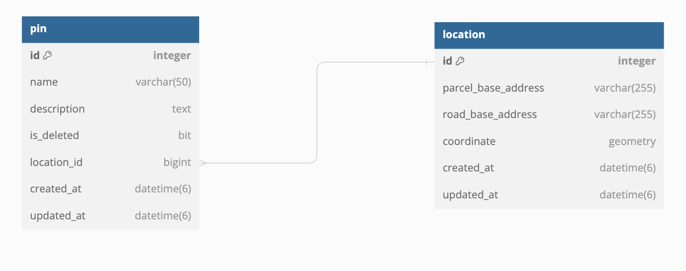
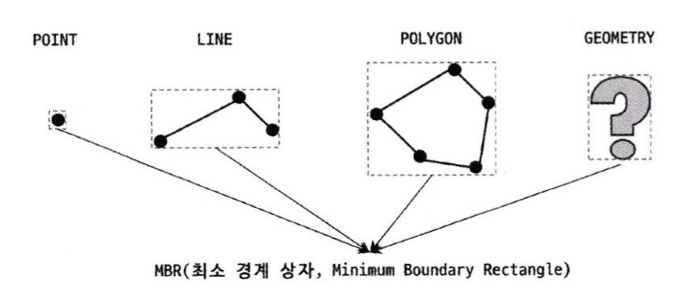
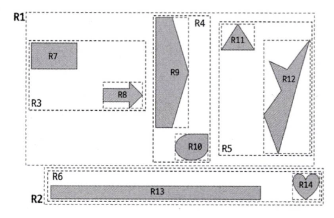
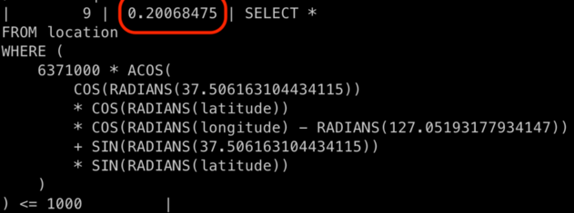
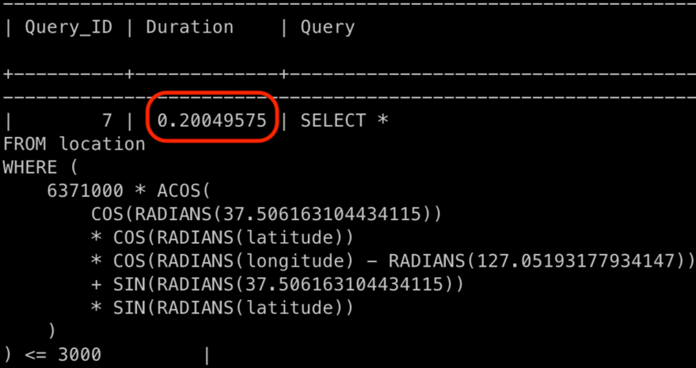
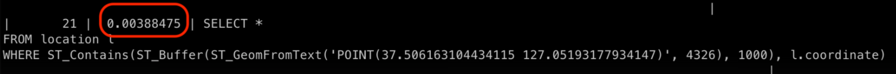
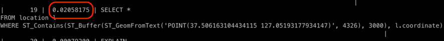

> 이 글은 우아한테크코스 괜찮을지도팀의 `쥬니`가 작성했습니다.

### 배경

`괜찮을지도` 서비스는 아래와 같이, 위치와 관련된 정보를 별도의 테이블로 관리하고 있습니다.



장소를 등록할 때, 주소 검색을 사용할 수도 있지만, **지도 위의 좌표를 클릭하여 등록**할 수도 있습니다.
<br> 사용자들이 동일한 장소를 등록하기 위해 지도상의 특정 위치를 클릭한다고 가정해 보겠습니다.
<br> 이때, 미터 혹은 그 이하의 오차 없이 동일한 위치를 선택할 확률은 얼마나 될까요 ?
<br> 거의 불가능에 가깝다고 생각합니다.
<br> 물론, 사용자의 입력을 그대로 저장할 필요도 있었습니다.
<br> 하지만, 데이터의 정확성이 크게 요구되는 서비스는 아니라는 점에서, DB 공간을 효율적으로 관리하는 것이 우선시 되었습니다.
<br> 이에 따라, 등록 장소 반경 10M 이내에 좌표가 존재하는 경우, 기존 좌표를 재사용하기 위해 테이블을 분리한 것이었죠.

데이터 공간의 효율성을 위해, 장소 등록시 마다 매번 위치 좌표와 관련된 쿼리가 수행되고 있었습니다.
<br> 물론, 조회용 API에서 해당 로직을 수행하지 않기 때문에 인덱싱의 중요성이 그리 높지 않았습니다.
<br> 하지만, 추후 사용자의 접속 위치를 기반으로 여러 기능들을 제공할 계획을 가지고 있습니다.
<br> 현재의 기능을 위해서도, 앞으로의 기능을 위해서도 공간 인덱스 적용은 반드시 필요한 상황이었습니다.

### 공간 인덱스
공간 인덱스는 2차원 공간 개념 값을 다루는 R-Tree 알고리즘을 사용합니다.
<br> 이러한 R-Tree 알고리즘을 이해하기 위해서는 `MBR`이라는 개념이 필수적입니다.
<br> MBR(Minimum Bounding Rectangle)은 아래 사진 하나로 설명이 가능할 것 같습니다.


>출처 : Real My SQL 8.0

MySQL에서는 공간 정보를 나타내는 데이터 타입으로 Point, Line, Polygon, Geometry를 지원합니다. 
<br> MBR은 이러한 데이터 타입을 감쌀 수 있는 최소 크기의 사각형을 의미합니다.


>출처 : Real My SQL 8.0

이러한 MBR의 포함 관계를 위 사진처럼 나타낼 수 있습니다.
<br> 이를 B-Tree 형태로 구현한 인덱스가 R-Tree 인덱스입니다.

이 정도의 지식만 있으면, 공간 인덱스를 적용하는 데에 큰 어려움은 없습니다. 

### 기존 코드
```java
    // LocationRepository.class

    @Query(
            "SELECT l FROM Location l "
                    + "WHERE ( 6371000 * acos( cos( radians(:#{#current_coordinate.latitude}) ) "
                    + "      * cos( radians( l.coordinate.latitude ) ) "
                    + "      * cos( radians( l.coordinate.longitude ) - radians(:#{#current_coordinate.longitude}) ) "
                    + "      + sin( radians(:#{#current_coordinate.latitude}) ) "
                    + "      * sin( radians( l.coordinate.latitude ) ) ) ) <= :distance"
    )
    List<Location> findAllByCoordinateAndDistanceInMeters(      
            @Param("current_coordinate") Coordinate coordinate,
            @Param("distance") double distance
    );
```

공간 인덱스를 적용하기 전, 등록 좌표를 기준으로 특정 반경 내에 존재하는 좌표를 조회하는 로직입니다.
<br> 위 로직은 `좌표 기반 거리 계산을 위한 Haversine 공식`을 적용한 것입니다.
<br> 로직을 이해하기도 어렵고, Table Full Scan을 통해 쿼리가 수행되므로, 성능 개선이 필요한 상태입니다.

### 공간 인덱스 적용
```java
//build.gradle

implementation 'org.hibernate:hibernate-spatial:6.2.5.Final'
```
우선, 공간 인덱스를 적용하기 위해 위와 같은 의존성을 추가해 줍니다.
<br> 버전은 프로젝트에서 사용하고 있는 JPA 버전에 따라 달라집니다.

--- 

```java
    // Location.class

        ...
    /*
     * 4326은 데이터베이스에서 사용하는 여러 SRID 값 중, 일반적인 GPS기반의 위/경도 좌표를 저장할 때 쓰이는 값입니다.
     * */
    private static final GeometryFactory geometryFactory = new GeometryFactory(new PrecisionModel(), 4326);

    @Column(columnDefinition = "geometry SRID 4326", nullable = false)
    private Point coordinate;

    private Coordinate(Point point) {
        this.coordinate = point;
    }


    public static Coordinate of(double latitude, double longitude) {
        validateRange(latitude, longitude);

        Point point = geometryFactory.createPoint(new org.locationtech.jts.geom.Coordinate(longitude, latitude));

        return new Coordinate(point);
    }
        ...
```
위 코드에서 주의 깊게 보아야 할 점은 `SRID`입니다.
<br> SRID는 여러 좌표(평면 좌표, 공간 좌표 등)를 나타내는 식별자라고 생각하시면 됩니다. 
<br> 만약, SRID 값이 서로 다를 경우, 공간 인덱스를 적용할 수 없습니다.
<br> (엄밀히 이야기하자면, 인덱스를 타지 않는다고 표현하는 것이 맞는 것 같습니다.)
<br> 힘들게 공간 인덱스를 적용했는데 ! 실제 쿼리에서 Full-Scan이 일어난다면.. 마음이 아프겠죠 ?
<br> 코드 주석으로도 남겨져 있지만, 일반적인 위/경도 좌표를 저장할 때 쓰이는 값인 `4326`으로 SRID 값을 설정하였습니다.

---

```java
    // LocationRepository.class

    @Query(
            "SELECT l FROM Location l "
                    + "WHERE ST_Contains(ST_Buffer(:coordinate, :distance), l.coordinate.coordinate)"
    )
    List<Location> findAllByCoordinateAndDistanceInMeters(
            @Param("coordinate") Point coordinate,
            @Param("distance") double distance
    );
```
드디어 마지막 단계입니다.
<br> 위 코드에서 `ST_Contains`와 `ST_Buffer`라는 함수가 생소하실 텐데요.
<br> 이는 MySQL에서 공간 인덱스를 지원해 주는 함수입니다.
<br> 각 함수를 간단하게 설명하자면 다음과 같습니다.
**<br> ST_Buffer(Coordinate, Distance) : Coordinate로부터, Distance(Meter)내에 존재하는 MBR을 반환한다.** 
**<br> ST_Contains(MBR, Coordinate) : MBR 이내에 해당 Coordinate의 포함 여부를 반환한다.**
<br> 이처럼, MySQL에서 지원해주는 함수를 통해 공간 인덱스를 적용할 모든 준비가 끝났습니다.

물론, 위 로직에서는 한 가지 문제가 존재합니다.
<br>
> 출처 : 매튜

위 사진 속 원의 원점이 좌표라고 가정하면 특정 거리 내의 좌표들은 빨간색 원 이내에 존재해야 합니다.
<br> 하지만, 위 로직에서는 회색의 잉여 공간(?)이 존재하게 됩니다.
<br> 즉, 특정 거리보다 더 멀리 있는 좌표들도 조회할 수 있게 되는 문제가 발생합니다.
<br> 이를 해결하는 방법은 `ST_DISTANCE`라는 함수를 사용하는 것입니다.
<br> 하지만, 해당 함수는 공간 인덱스를 지원하지 않는다는 단점이 존재합니다.
<br> 정확성이 요구되는 서비스라면, 공간 인덱스를 사용하기 어렵다는 뜻이죠.
<br> 우리 서비스에서는 `엄청난 정확성을 요구하지 않는다는 점`과 `성능 향상`의 이유에서 위의 로직을 그대로 가져가기로 결정했습니다. 

---

```sql
ALTER TABLE location ADD COLUMN coordinate GEOMETRY NOT NULL SRID 4326;
```
**만약, 해당 테이블 새로 생성한 것이 아니라, 기존 테이블 구조를 변경한다면 SRID 값을 명시적으로 설정해 주어야 합니다.**
**<br> 단순히 컬럼만 추가한다면, SRID 값이 0으로 설정되기 때문이죠.**

```sql
create spatial index location_idx01 on location(coordinate);
```
마지막으로, 데이터베이스에 위와 같은 쿼리를 수행함으로써 공간 인덱스 적용이 끝나게 됩니다.

### 성능 테스트

총 데이터는 약 10만건이 존재하며, 1km 이내의 데이터, 3km 이내의 데이터 조회를 수행하였습니다.

공간 인덱스 적용 전
1km 이내 (40건)<br>


3km 이내 (300건)<br>


공간 인덱스 적용 후
1km 이내 (40건)<br>


3km 이내 (300건)<br>


**성능이 최소 10배 이상 차이 나는 것을 확인할 수 있었습니다.**

**예비군으로 인해, 대신 성능 테스트를 진행해 준 `준팍` 고맙습니다 !**

### 마치며

공간 인덱스 적용을 위해 사용한 함수들은 `MySQL`에서 지원하는 함수입니다.
<br> 즉, 테스트 환경이 `H2`라면 오류가 발생할 수 있습니다.
<br> `H2`에서는 지원해 주지 않는 함수들이기 때문이죠.
<br> 이런 상황에서는 `TestContainer`를 통해 해결할 수 있습니다.

테스트 환경이 `MySQL`이더라도, `@DataJpaTest`를 사용한다면 오류가 발생할 수 있습니다.
<br> 내부적으로 인메모리 `H2`를 사용하기 때문인데요.
<br> `@AutoConfigureTestDatabase(replace = Replace.NONE)`설정을 통해 해결할 수 있습니다.

### 참고
Real My SQL 8.0 1판/2판
