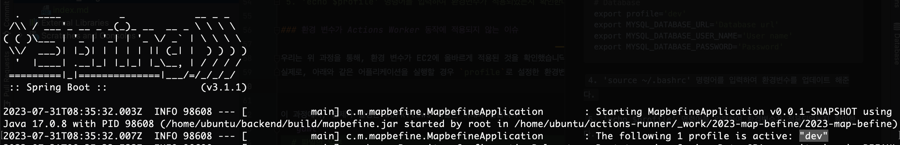
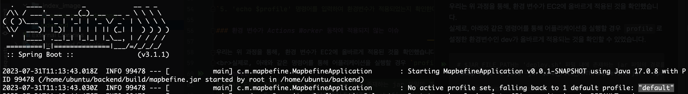

> 이 글은 우테코 괜찮을지도의 `쥬니`가 작성하였습니다.

### 배경

괜찮을지도 서비스는 CI/CD 툴로 Github Actions를 적용하였습니다.
<br> 자세한 내용이 궁금하다면 ? [괜찮을지도 CI/CD 구축기 바로가기](/contents/posts/github-actions-ci-cd/index.md)

프로젝트의 설정 파일(.yml)은 DB 주소 등 민감한 정보를 담고 있었기 때문에, 이를 저장소에 그대로 업로드할 수 없었습니다.
<br>위 문제점을 해결하기 위한 과정과 실제 우리가 직면한 문제를 설명해 드리고자 합니다.

### 환경변수 적용
괜찮을지도는 환경 변수를 활용하여 민감한 정보를 숨기기로 했습니다.
이에 따라, 각 배포 환경(prod, dev)에 맞는 설정 파일을 아래와 같이 작성하였습니다.
```yaml
# `application-dev`의 일부 
spring:
  datasource:
    driver-class-name: com.mysql.cj.jdbc.Driver
    url: ${MYSQL_DATABASE_URL} 
    username: ${MYSQL_DATABASE_USER_NAME}
    password: ${MYSQL_DATABASE_PASSWORD}
```
설정 파일에서 사용한 환경 변수는 각 EC2 인스턴스에서 관리하도록 하였습니다.
<br>EC2 인스턴스에 환경변수를 적용하는 방법은 아래와 같습니다.

`1. EC2 터미널에 접속한다.`

`2. 'sudo vim ~/.bashrc' 명령어를 입력한다.`

`3. .bashrc 파일의 맨 아래에 아래와 같이 필요한 환경변수를 입력한 뒤, 저장한다.`
```shell
# ...
# 기존 .bashrc 코드 생략 
#
# Database
export profile='dev'
export MYSQL_DATABASE_URL='Database url'
export MYSQL_DATABASE_USER_NAME='User name'
export MYSQL_DATABASE_PASSWORD='Password'
```

`4. 'source ~/.bashrc' 명령어를 입력하여 환경변수를 업데이트해 준다.`

`5. 'echo $profile' 명령어를 입력하여 환경변수가 적용되었는지 확인한다.`

### 환경 변수가 Actions Runner 동작에 적용되지 않는 이슈

우리는 위 과정을 통해, 환경 변수가 EC2에 올바르게 적용된 것을 확인했습니다.
<br>실제로, 아래와 같은 명령어를 통해 어플리케이션을 실행할 경우 `profile`로 설정한 환경변수인 dev가 올바르게 적용되는 것을 확인할 수 있었습니다.
```shell
# $JAR_FILE_PATH는 'deploy.sh' 파일 내에 존재하는 jar 파일의 경로를 나타내는 변수입니다.
nohup sudo -E java -jar $JAR_FILE_PATH/mapbefine.jar --spring.profiles.active=$profile >> $JAR_FILE_PATH/deploy.log 2> $JAR_FILE_PATH/deploy-err.log &
```


하지만, Actions Runner를 통해 CD를 수행하는 경우 아래와 같이 환경 변수가 적용되지 않았습니다.


우리는 위 문제를 해결하기 위해, 아래와 같이 우리의 상황을 정리하였습니다.
1. 터미널에서 쉘 스크립트를 실행할 경우, 환경 변수가 적용된다.
2. Actions Runner를 통해 쉘 스크립트를 실행할 경우, 환경변수가 적용되지 않는다.
3. CI/CD를 구축한 뒤에 환경 변수를 적용했다.

위 상황을 통해, 우리는 환경 변수를 적용하기 전, 이미 실행되고 있었던 Actions Runner에 환경변수가 적용되지 않았음을 직감할 수 있었습니다.
<br>실제로, 환경 변수는 프로세스가 시작될 때 해당 프로세스에게 제공되는 환경 설정의 일부이기 때문에, 위와 같은 문제가 발생한 것이었습니다.

기존에 실행되고 있었던 Actions Runner 프로세스를 종료한 후, 재시작을 하였고 환경 변수가 올바르게 적용되는 것을 확인할 수 있었습니다.